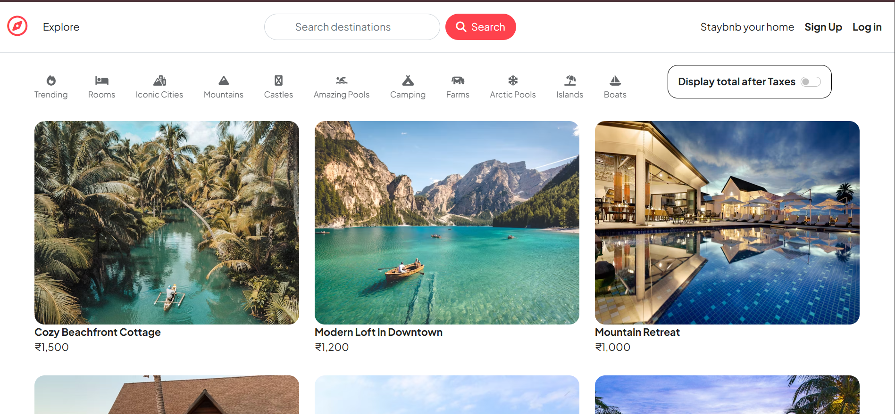

# 🏡 Staybnb – Online Marketplace for Homestays and Experiences


Staybnb is a full-stack web application inspired by Airbnb that enables users to browse, list, and book short-term rental properties. It features user authentication, property management, and booking functionality.


## 🖱️Live Demo
[](https://youtu.be/c1PWDNnYe7c)


## ✨ Features

- 🔐 User authentication (register/login/logout)
- 🏠 Hosts can list properties with images and details
- 🌍 Geolocation-based search with Map APIs (Mapbox) 
- 📱 Mobile responsiveness enhancements  
- ⭐ Review and rating system for users 
- 📤 Upload and manage property listings
- 📦 RESTful API structure


## 🛠️ Tech Stack

**Frontend:** HTML, CSS, JavaScript, Bootstrap  
**Backend:** Node.js, Express.js  
**Database:** MongoDB (Mongoose)  ,  MongoDB Atlas
**Tools & Libraries:** Cloudinary,  Mapbox


## 🚀 Getting Started

1. **Clone the Repository**
```markdown
   git clone https://github.com/Priyanshi800/Staybnb
```

2. **Install Dependencies**
```markdown
    npm install
```

3. **Setup Environment Variables**
    Create a .env file in the root directory:
```markdown
    PORT=8080
    MONGODB_URI=your_mongodb_connection_string
    SESSION_SECRET=your_secret_key
    CLOUDINARY_CLOUD_NAME=your_cloudinary_cloud_name
    CLOUDINARY_API_KEY=your_cloudinary_api_key
    CLOUDINARY_API_SECRET=your_cloudinary_api_secret
    MAP_TOKEN=enter_your_mapbox_token
```

4. **Run the App**
```markdown
    node app.js
```

```markdown
Visit: http://localhost:8080
```


## 🧠 What I Learned

- Structuring a full-stack Node.js web application  
- Creating and securing REST APIs with Express  
- Implemented CRUD (Create, Read, Update, Delete) operations  
- Working with MongoDB and Mongoose for data modeling  
- Handling file uploads with Multer  
- Building a responsive frontend with Bootstrap


## 💡 Future Improvements

- 💳 Stripe integration for payments  
- 🔍 Users can search and filter properties(UI)
- 📅 Book properties for specific dates 
- 🛠️ Admin panel for managing listings


